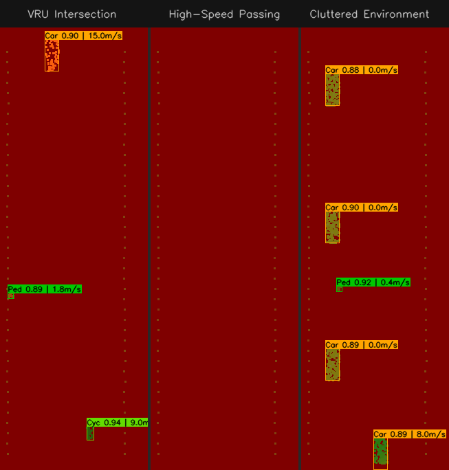
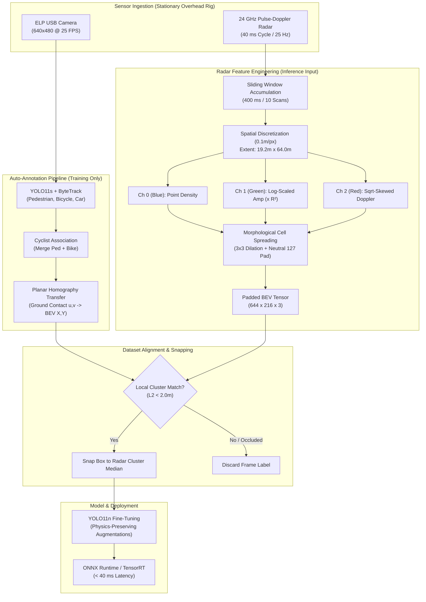
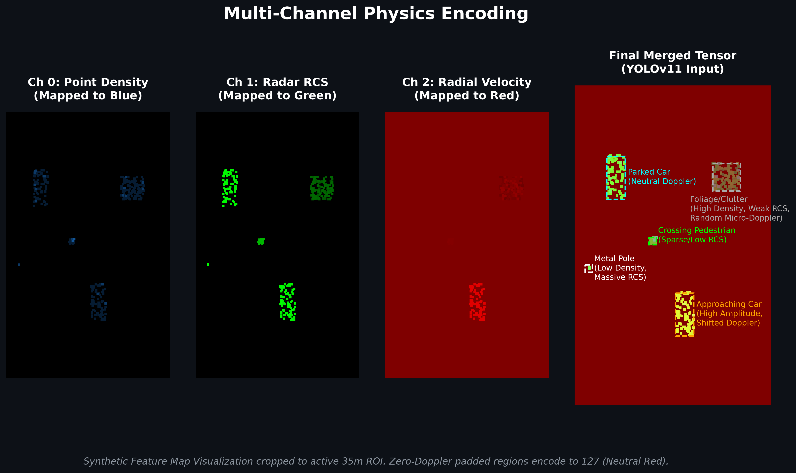

# Road User Detection in Radar Bird's-Eye View

[](https://python.org)
[](https://pytorch.org)
[](https://github.com/ultralytics/ultralytics)
[](https://onnx.ai)
[](LICENSE)

An end-to-end deep learning pipeline that transforms sparse 24 GHz pulse-Doppler radar point clouds into dense Bird's-Eye View (BEV) feature representations. This project utilizes cross-modal weak supervision, employing an optical camera strictly for automated dataset annotation during training, to train real-time vision detectors (YOLO11) that localize and classify road users solely from radar telemetry at inference time.

Developed in collaboration with Furukawa Electric Institute of Technology (FETI).

---

## Inference Demonstration



*Synthetic visualization of the YOLO11 network processing 3-channel radar representations in real-time (40 ms cycles). Bounding boxes indicate metric-accurate localizations directly inferred from radar cross-section and Doppler velocity signatures. Notice the yielding car in the left panel: the BEV tensor natively captures its deceleration as its Doppler color signature visually shifts toward neutral red/grey when it brakes for the crossing pedestrian.*

---

## Overview

Optical camera systems frequently fail in fog, rain, glare, or darkness, and raise privacy concerns in public traffic monitoring. Stationary roadside radar solves these issues but produces sparse, noisy point clouds lacking semantic structure.

This project bridges that gap by:
1. Using an overhead optical camera, ByteTrack, and planar homography to project ground-truth bounding boxes onto the radar ground plane to automatically generate training labels (Cross-Modal Weak Supervision).
2. Encoding sparse point returns across time into a dense 3-channel pseudo-image representing Occupancy Density, R-squared Compensated Electric Field Amplitude, and Signed Doppler Radial Velocity.
3. Overcoming homography perspective drift by snapping camera bounding box priors to local radar reflection clusters.
4. Exporting the trained network to ONNX for sub-40 ms inference throughput on edge accelerators.

---

## Architecture & Data Flow



---

## Technical Implementation

### 1. Data Engineering: Sparse Radar to Dense BEV Tensors


*Synthetic feature map visualization cropped to the active 35m region of interest. Zero-Doppler padded regions encode to 127 (Neutral Red). Data simulates exact R² compensation and Doppler distribution math used in production.*

To enable standard vision backbones (CNN / CSPNet) to extract features from radar data, raw returns are rasterized onto a 0.1 m/pixel grid spanning [-9.6 m, +9.6 m] laterally and [0.0 m, 64.0 m] longitudinally. Because vision models are optimized for 3-channel inputs, the data is encoded as:
* **Channel 0 (Blue - Spatial Occupancy):** Point return count accumulated over a sliding 400 ms window, representing physical footprint.
* **Channel 1 (Green - Reflected Energy):** Electric field amplitude compensated for two-way free-space path loss (R²). Utilizing both Density and Amplitude allows the network to distinguish highly reflective small objects (metal poles) from large but absorptive environmental clutter (foliage).
* **Channel 2 (Red - Radial Velocity):** Signed Doppler frequency shift scaled to physical units. Transformed via signed square-root compression to emphasize low-speed pedestrian motion, with zero-Doppler backgrounds explicitly mapped to neutral (127).

### 2. Homography Drift & Radar Snapping
Optical bounding box projections through planar homography degrade with target distance due to camera pitch oscillation and suspension movement.
* An automated Radar Snapping algorithm queries raw points within a 2.0 m radius of the projected optical ground-contact point.
* The bounding box center is computationally snapped to the median radar cluster coordinate, and the down-range edge is anchored to the leading radar echo, systematically eliminating label misalignment and perspective drift.

---

## Dataset & Class Distribution

The dataset covers multi-modal road scenarios recorded across varied weather and lighting conditions at the FETI test site:

| Class | Physical Prior (W x L) | Characteristics |
| :--- | :--- | :--- |
| **Pedestrian** | 0.8 m x 0.8 m | Micro-Doppler limb motion, sparse point returns |
| **Cyclist** | 1.0 m x 2.0 m | Fast linear motion with pedaling Doppler spread |
| **Car** | 2.0 m x 4.8 m | High-amplitude corner-reflector returns, multi-point clusters |

---

## Real-Time Performance & Deployment

| Model Architecture | Input Resolution | mAP@50 | Latency (NVIDIA RTX 4050) | Target Hardware |
| :--- | :--- | :--- | :--- | :--- |
| **YOLO11s (Baseline)** | 644 x 216 | 0.406 | ~14.2 ms | Workstation / Edge Server |
| **YOLO11n (Optimized)** | 644 x 216 | *Pending* | **~3.8 ms** | Jetson Orin Nano / Xavier |

Both models strictly satisfy the live sensor frame budget (40 ms, or 25 FPS).

---

## Installation & Usage

### Prerequisites
* Python 3.10+
* NVIDIA GPU with CUDA 11.8 / 12.0+

```bash
# Clone the repository
git clone https://github.com/your-username/your-repo.git
cd your-repo

# Set up virtual environment
python -m venv venv
source venv/bin/activate  # On Windows: venv\Scripts\activate

# Install dependencies
pip install -r requirements.txt
```

### Running the End-to-End Pipeline

```bash
# 1. Optical auto-annotation & homography projection
python scripts/annotation_pipeline.py --run_batch --run_inference --run_homography --conf 0.15 --tracker_type bytetrack

# 2. Radar point cloud rasterization & BEV pseudo-image generation
python scripts/grid_mapping_pipeline.py

# 3. Label synchronization and radar cluster snapping
python scripts/dataset_preparation.py

# 4. Train the BEV detector
python scripts/training.py

# 5. Export weights for deployment
python scripts/export_model.py
```

---

## Confidentiality Notice

In compliance with the Non-Disclosure Agreement (NDA) with Furukawa Electric Institute of Technology (FETI), all raw radar telemetry (`radar1_resp.csv`), synchronized video feeds (`video1.avi`), and generated ground-truth datasets are omitted from this repository. The source code demonstrates the mathematical modeling, preprocessing pipelines, and deep learning architectures developed for the project, supplemented entirely by mathematically accurate synthetic visualizations.